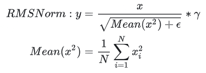
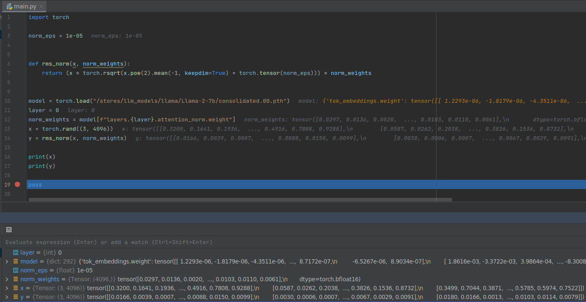
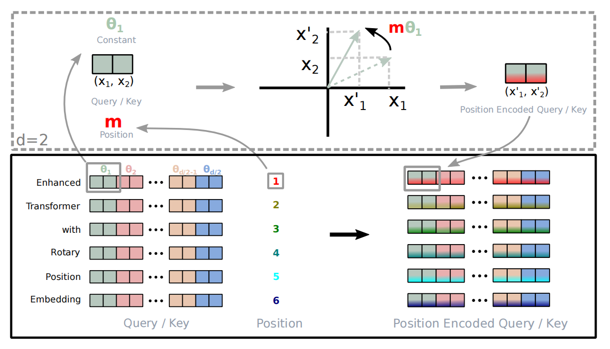
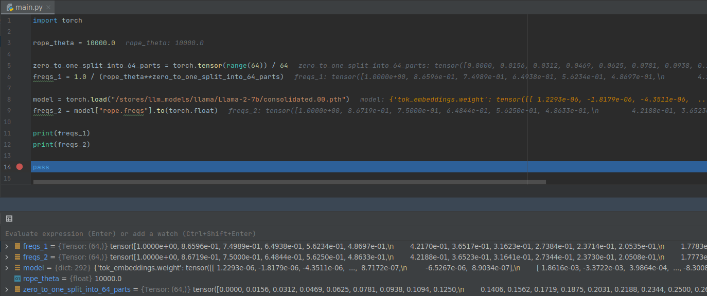
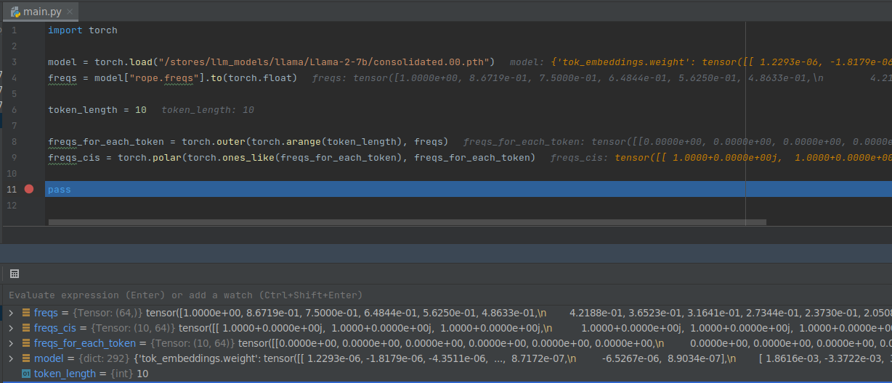
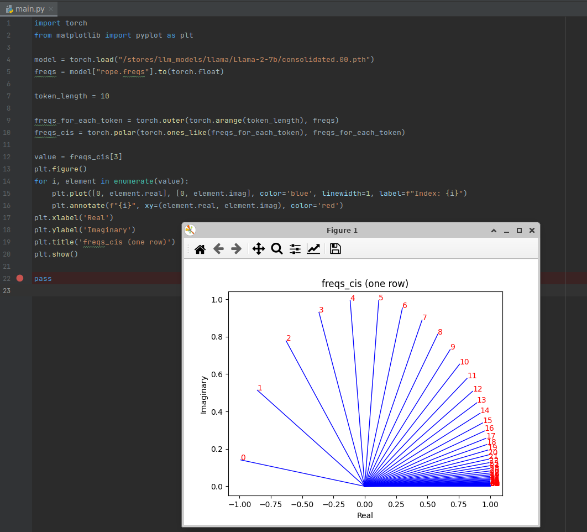
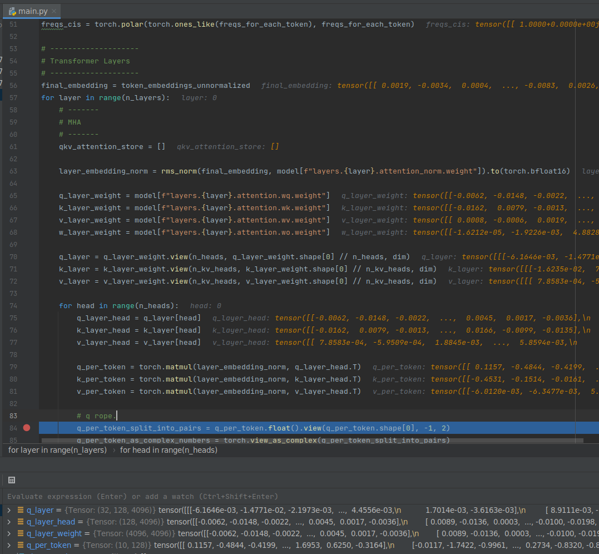
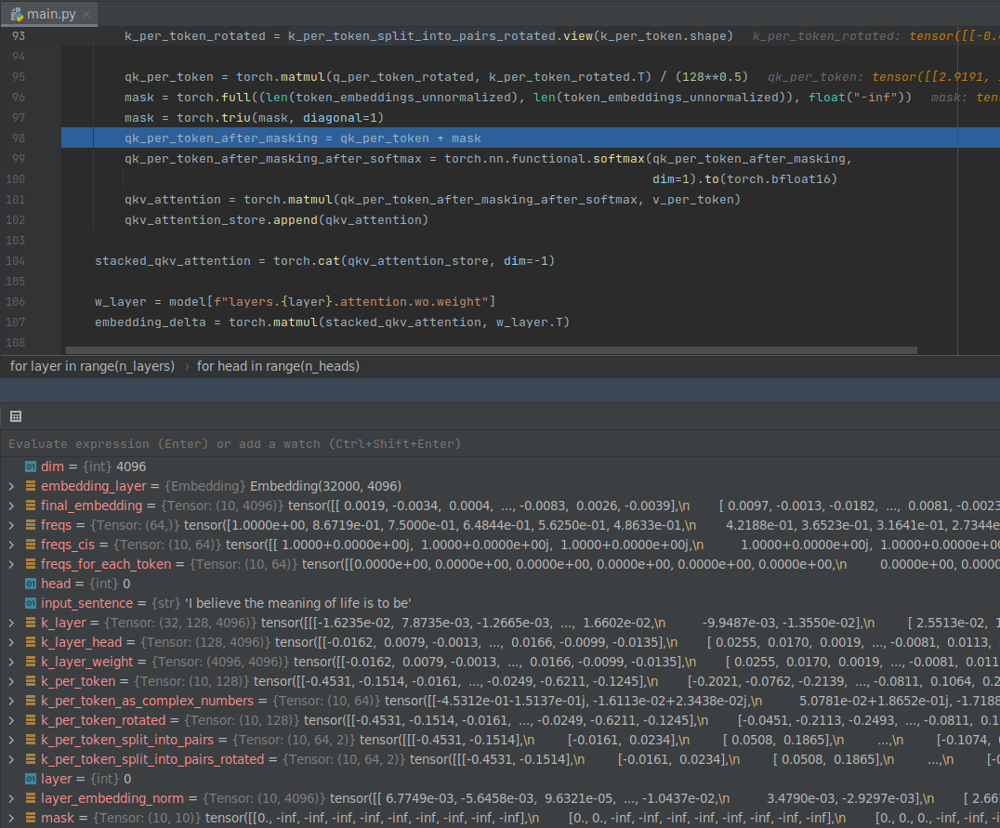
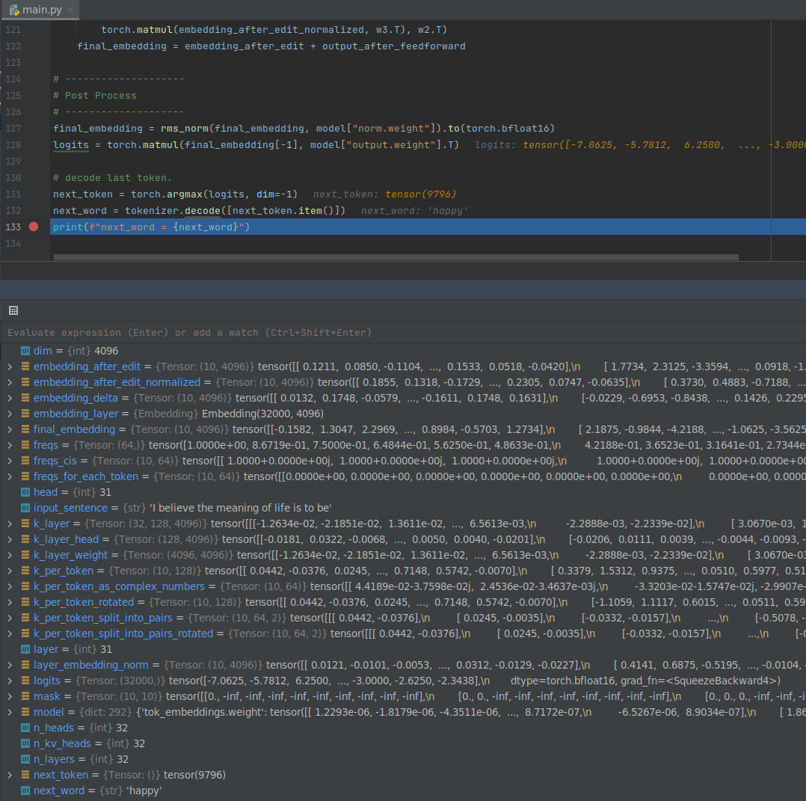

***
# 1. Introduction

official LLaMA model definition can be find in https://github.com/meta-llama/llama.

this part will introduce structure of LLaMA2-7B model, and also the links to download model weight.

***
### 1.1 model structure.


***
### 1.2 download model.

| site       | download link                                          |
|------------|--------------------------------------------------------|
| gitee      | https://ai.gitee.com/hf-models/meta-llama/Llama-2-7b   |
| modelscope | https://www.modelscope.cn/models/shakechen/Llama-2-7b  |

from above two site you can download model weight for inference.

***
### 1.3 model parameters.

```python
import json
import torch

model = torch.load("/stores/llm_models/llama/Llama-2-7b/consolidated.00.pth")
print(json.dumps(list(model.keys()), indent=4))
```

    [
        "tok_embeddings.weight",
        "norm.weight",
        "output.weight",
        "layers.0.attention.wq.weight",
        "layers.0.attention.wk.weight",
        "layers.0.attention.wv.weight",
        "layers.0.attention.wo.weight",
        "layers.0.feed_forward.w1.weight",
        "layers.0.feed_forward.w2.weight",
        "layers.0.feed_forward.w3.weight",
        "layers.0.attention_norm.weight",
        "layers.0.ffn_norm.weight",
        ...
        "layers.31.attention.wq.weight",
        "layers.31.attention.wk.weight",
        "layers.31.attention.wv.weight",
        "layers.31.attention.wo.weight",
        "layers.31.feed_forward.w1.weight",
        "layers.31.feed_forward.w2.weight",
        "layers.31.feed_forward.w3.weight",
        "layers.31.attention_norm.weight",
        "layers.31.ffn_norm.weight",
        "rope.freqs"
    ]

you can find there are **32** layers for LLaMA2-7B weight.

| weight name                     | usage                |
|---------------------------------|----------------------|
| tok_embeddings.weight           | embedding layer      |
| rope.freqs                      | RoPE operator in MHA |
| layers.*.attention_norm.weight  | MHA                  |
| layers.*.attention.wq.weight    | MHA                  |
| layers.*.attention.wk.weight    | MHA                  |
| layers.*.attention.wv.weight    | MHA                  |
| layers.*.attention.wo.weight    | MHA                  |
| layers.*.ffn_norm.weight        | FFN                  |
| layers.*.feed_forward.w1.weight | FFN                  |
| layers.*.feed_forward.w2.weight | FFN                  |
| layers.*.feed_forward.w3.weight | FFN                  |
| norm.weight                     | LM head              |
| output.weight                   | LM head              |


you can see the default data type of weight is **bfloat16**.

***
# 2. Operators.

this part will introduce operators that used in LLaMA2-7B model.

***
### 2.1 tokenizer.

```python
import torch
from sentencepiece import SentencePieceProcessor

tokenizer = SentencePieceProcessor("/stores/llm_models/llama/Llama-2-7b/tokenizer.model")

input_sentence = "I believe the meaning of life is to be"
tokens = tokenizer.encode(input_sentence)
tokens = [tokenizer.bos_id()] + tokens
tokens = torch.tensor(tokens)

print(f"input_sentence = {input_sentence}")
print(tokens)
```


The LLaMA tokenizer is a **BPE** model based on **sentencepiece**.

***
### 2.2 embedding.

```python
import torch

dim = 4096
vocab_size = 32000

model = torch.load("/stores/llm_models/llama/Llama-2-7b/consolidated.00.pth")

embedding_layer = torch.nn.Embedding(vocab_size, dim)
embedding_layer.weight.data.copy_(model["tok_embeddings.weight"])
```


***
### 2.3 RMS (Root Mean Square Normalization).



```python
import torch

norm_eps = 1e-05

def rms_norm(x, norm_weights):
    return (x * torch.rsqrt(x.pow(2).mean(-1, keepdim=True) + torch.tensor(norm_eps))) * norm_weights

model = torch.load("/stores/llm_models/llama/Llama-2-7b/consolidated.00.pth")
layer = 0
norm_weights = model[f"layers.{layer}.attention_norm.weight"]
x = torch.rand((3, 4096))
y = rms_norm(x, norm_weights)

print(x)
print(y)
```



you can see **layers.*.attention_norm.weight** is the weight of γ (gamma) in RMS formula.

***
### 2.4 RoPE (Rotary Position Embedding).



above picture shows how RoPE embed position info into Q and K.

***
##### rope.freqs
```python
import torch

rope_theta = 10000.0

zero_to_one_split_into_64_parts = torch.tensor(range(64)) / 64
freqs_1 = 1.0 / (rope_theta**zero_to_one_split_into_64_parts)

model = torch.load("/stores/llm_models/llama/Llama-2-7b/consolidated.00.pth")
freqs_2 = model["rope.freqs"].to(torch.float)

print(freqs_1)
print(freqs_2)
```



you can see **rope.freqs** in weight file is pre-computed freqs.

***
##### freqs_cis

```python
import torch

model = torch.load("/stores/llm_models/llama/Llama-2-7b/consolidated.00.pth")
freqs = model["rope.freqs"].to(torch.float)

token_length = 10

freqs_for_each_token = torch.outer(torch.arange(token_length), freqs)
freqs_cis = torch.polar(torch.ones_like(freqs_for_each_token), freqs_for_each_token)
```



you can see the size of freqs_cis is **(10, 64)**.

***
##### freqs_cis one row plot image.

```python
import torch
from matplotlib import pyplot as plt

model = torch.load("/stores/llm_models/llama/Llama-2-7b/consolidated.00.pth")
freqs = model["rope.freqs"].to(torch.float)

token_length = 10

freqs_for_each_token = torch.outer(torch.arange(token_length), freqs)
freqs_cis = torch.polar(torch.ones_like(freqs_for_each_token), freqs_for_each_token)

value = freqs_cis[3]
plt.figure()
for i, element in enumerate(value):
    plt.plot([0, element.real], [0, element.imag], color='blue', linewidth=1, label=f"Index: {i}")
    plt.annotate(f"{i}", xy=(element.real, element.imag), color='red')
plt.xlabel('Real')
plt.ylabel('Imaginary')
plt.title('freqs_cis (one row)')
plt.show()
```



***
### 2.5 MHA (Multi-Headed Attention).

***
##### q_layer_head

```python
import torch

model = torch.load("/stores/llm_models/llama/Llama-2-7b/consolidated.00.pth")

dim = 4096
n_heads = 32

layer = 0
head = 0

q_layer_weight = model[f"layers.{layer}.attention.wq.weight"]
q_layer = q_layer_weight.view(n_heads, q_layer_weight.shape[0] // n_heads, dim)

q_layer_head = q_layer[head]
```


from above picture you can see **layers.0.attention.wq.weight** is split into 32 parts.

| tensor name    | size            |
|----------------|-----------------|
| q_layer_weight | (4096, 4096)    |
| q_layer        | (32, 128, 4096) |
| q_layer_head   | (128, 4096)     |

***
##### q_per_token



| tensor name          | size        |
|----------------------|-------------|
| layer_embedding_norm | (10, 4096)  |
| q_layer_head         | (128, 4096) |
| q_per_token          | (10, 128)   |

here need transpose q_layer_head due to **q_layer_weight** is torch.nn.Linear's weight.

***
##### mask



    tensor([[0., -inf, -inf, -inf, -inf, -inf, -inf, -inf, -inf, -inf],
            [0., 0., -inf, -inf, -inf, -inf, -inf, -inf, -inf, -inf],
            [0., 0., 0., -inf, -inf, -inf, -inf, -inf, -inf, -inf],
            [0., 0., 0., 0., -inf, -inf, -inf, -inf, -inf, -inf],
            [0., 0., 0., 0., 0., -inf, -inf, -inf, -inf, -inf],
            [0., 0., 0., 0., 0., 0., -inf, -inf, -inf, -inf],
            [0., 0., 0., 0., 0., 0., 0., -inf, -inf, -inf],
            [0., 0., 0., 0., 0., 0., 0., 0., -inf, -inf],
            [0., 0., 0., 0., 0., 0., 0., 0., 0., -inf],
            [0., 0., 0., 0., 0., 0., 0., 0., 0., 0.]])

from above picture you can see the size of mask is (10, 10).

***
### 2.6 FFN (Feed Forward Network).


| operator name | weight name |
|---------------|-------------|
| gate          | w1          |
| down          | w2          |
| up            | w3          |

***
### 2.7 LM head.



only need to get last row of **final_embedding**.

***
# 3. Inference code.

this part shows the python code of LLaMA2-7B inference.

```python
import torch

from sentencepiece import SentencePieceProcessor

# ----------------------------------------------------------------------------------------------------------------------
# llama2 7b parameters.
dim = 4096
vocab_size = 32000
norm_eps = 1e-05
n_heads = 32
n_kv_heads = 32
n_layers = 32
rope_theta = 10000.0

# ----------------------------------------------------------------------------------------------------------------------
tokenizer = SentencePieceProcessor("/stores/llm_models/llama/Llama-2-7b/tokenizer.model")
model = torch.load("/stores/llm_models/llama/Llama-2-7b/consolidated.00.pth")


def rms_norm(x, norm_weights):
    return (x * torch.rsqrt(x.pow(2).mean(-1, keepdim=True) + torch.tensor(norm_eps))) * norm_weights


# ----------------------------------------------------------------------------------------------------------------------
# set embedding_layer.

# set freqs

# --------------------
# Input
# --------------------
input_sentence = "I believe the meaning of life is to be"
print(f"input_sentence = {input_sentence}")

tokens = tokenizer.encode(input_sentence)
tokens = [tokenizer.bos_id()] + tokens
tokens = torch.tensor(tokens)

# --------------------
# Embedding Layer
# --------------------
embedding_layer = torch.nn.Embedding(vocab_size, dim)
embedding_layer.weight.data.copy_(model["tok_embeddings.weight"])
token_embeddings_unnormalized = embedding_layer(tokens).to(torch.bfloat16)

# --------------------
# prepare freqs_cis
# --------------------
freqs = model["rope.freqs"].to(torch.float)
freqs_for_each_token = torch.outer(torch.arange(len(tokens)), freqs)
freqs_cis = torch.polar(torch.ones_like(freqs_for_each_token), freqs_for_each_token)

# --------------------
# Transformer Layers
# --------------------
final_embedding = token_embeddings_unnormalized
for layer in range(n_layers):
    # -------
    # MHA
    # -------
    qkv_attention_store = []

    layer_embedding_norm = rms_norm(final_embedding, model[f"layers.{layer}.attention_norm.weight"]).to(torch.bfloat16)

    q_layer_weight = model[f"layers.{layer}.attention.wq.weight"]
    k_layer_weight = model[f"layers.{layer}.attention.wk.weight"]
    v_layer_weight = model[f"layers.{layer}.attention.wv.weight"]
    w_layer_weight = model[f"layers.{layer}.attention.wo.weight"]

    q_layer = q_layer_weight.view(n_heads, q_layer_weight.shape[0] // n_heads, dim)
    k_layer = k_layer_weight.view(n_kv_heads, k_layer_weight.shape[0] // n_kv_heads, dim)
    v_layer = v_layer_weight.view(n_kv_heads, v_layer_weight.shape[0] // n_kv_heads, dim)

    for head in range(n_heads):
        q_layer_head = q_layer[head]
        k_layer_head = k_layer[head]
        v_layer_head = v_layer[head]

        q_per_token = torch.matmul(layer_embedding_norm, q_layer_head.T)
        k_per_token = torch.matmul(layer_embedding_norm, k_layer_head.T)
        v_per_token = torch.matmul(layer_embedding_norm, v_layer_head.T)

        # q rope.
        q_per_token_split_into_pairs = q_per_token.float().view(q_per_token.shape[0], -1, 2)
        q_per_token_as_complex_numbers = torch.view_as_complex(q_per_token_split_into_pairs)
        q_per_token_split_into_pairs_rotated = torch.view_as_real(q_per_token_as_complex_numbers * freqs_cis)
        q_per_token_rotated = q_per_token_split_into_pairs_rotated.view(q_per_token.shape)

        # k rope.
        k_per_token_split_into_pairs = k_per_token.float().view(k_per_token.shape[0], -1, 2)
        k_per_token_as_complex_numbers = torch.view_as_complex(k_per_token_split_into_pairs)
        k_per_token_split_into_pairs_rotated = torch.view_as_real(k_per_token_as_complex_numbers * freqs_cis)
        k_per_token_rotated = k_per_token_split_into_pairs_rotated.view(k_per_token.shape)

        qk_per_token = torch.matmul(q_per_token_rotated, k_per_token_rotated.T) / (128**0.5)
        mask = torch.full((len(token_embeddings_unnormalized), len(token_embeddings_unnormalized)), float("-inf"))
        mask = torch.triu(mask, diagonal=1)
        qk_per_token_after_masking = qk_per_token + mask
        qk_per_token_after_masking_after_softmax = torch.nn.functional.softmax(qk_per_token_after_masking,
                                                                               dim=1).to(torch.bfloat16)
        qkv_attention = torch.matmul(qk_per_token_after_masking_after_softmax, v_per_token)
        qkv_attention_store.append(qkv_attention)

    stacked_qkv_attention = torch.cat(qkv_attention_store, dim=-1)

    w_layer = model[f"layers.{layer}.attention.wo.weight"]
    embedding_delta = torch.matmul(stacked_qkv_attention, w_layer.T)

    embedding_after_edit = final_embedding + embedding_delta

    # -------
    # FFN
    # -------
    embedding_after_edit_normalized = rms_norm(embedding_after_edit,
                                               model[f"layers.{layer}.ffn_norm.weight"]).to(torch.bfloat16)
    w1 = model[f"layers.{layer}.feed_forward.w1.weight"]
    w2 = model[f"layers.{layer}.feed_forward.w2.weight"]
    w3 = model[f"layers.{layer}.feed_forward.w3.weight"]
    output_after_feedforward = torch.matmul(
        torch.functional.F.silu(torch.matmul(embedding_after_edit_normalized, w1.T)) *
        torch.matmul(embedding_after_edit_normalized, w3.T), w2.T)
    final_embedding = embedding_after_edit + output_after_feedforward

# --------------------
# Post Process
# --------------------
final_embedding = rms_norm(final_embedding, model["norm.weight"]).to(torch.bfloat16)
logits = torch.matmul(final_embedding[-1], model["output.weight"].T)

# decode last token.
next_token = torch.argmax(logits, dim=-1)
next_word = tokenizer.decode([next_token.item()])
print(f"next_word = {next_word}")
```
